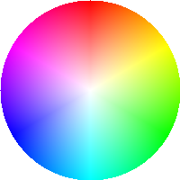
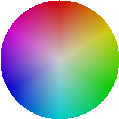
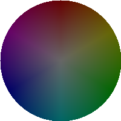

# create-color-wheel.py

指定した明度(V)の範囲の色相環をまとめて作成します。

[Color-Wheel](https://github.com/kantas-spike/Color-Wheel)の背景画像を作成するためのツールです。

## 使い方

~~~text
usage: create-color-wheel.py [-h] [-r RADIUS] [--start START] [--end END] [--step STEP] [--filename FILENAME] [--outputdir OUTPUTDIR]

指定した明度(V)の範囲の色相環をまとめて作成する

options:
  -h, --help            show this help message and exit
  -r RADIUS, --radius RADIUS
                        色相環の半径(default: 365)
  --start START         作成対象の明度範囲の開始値(default: 0)
  --end END             作成対象の明度範囲の終了値(default: 1.0)
  --step STEP           作成対象の明度範囲の間隔(default: 0.1)
  --filename FILENAME   作成する画像のファイル名。置換フィールドを指定可能(default: 'wheel_{:0.2f}.png')
  --outputdir OUTPUTDIR
                        作成する画像を保存するディレクトリ(default: './imgs')
~~~

本ツールは`poerty`でパッケージ管理しています。
以下のように`poerty`の仮想環境上で実行してください。

~~~shell
$ poetry run python3 create-color-wheel.py -r 100 --outputdir ./images
$ ls images
wheel_0.00.png  wheel_0.10.png  wheel_0.20.png  wheel_0.30.png  wheel_0.40.png  wheel_0.50.png  wheel_0.60.png  wheel_0.70.png  wheel_0.80.png  wheel_0.90.png  wheel_1.00.png
~~~

### 作成された色相環の例

|明度 1.00|明度 0.80|明度 0.60|明度 0.40|
|:---:|:---:|:---:|:---:|
|||||

## 環境構築

以下を実行し、関連するモジュールをインストールしてください。 注意: `poetry` でパッケージを管理しています。事前に`poetry`をインストールしてください。

~~~shell
poetry install
~~~

## 参考

- [Color wheel | rosettacode.org](https://rosettacode.org/wiki/Color_wheel#Python)